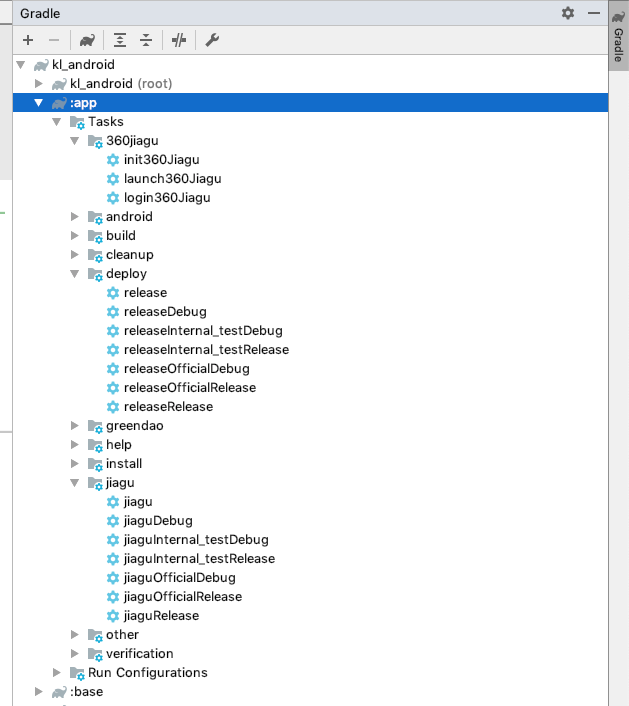

# Android 打包插件

## 功能说明

- 打包指定变种apk输出到指定的文件夹并充命名 
- 对指定变种apk进行加固（仅支持360加固）

## 使用

### 引入

- 添加 classpath
    ```groovy
    buildscript {        
        repositories {
            google()
            jcenter()

            // 添加仓库
            maven { url "https://plugins.gradle.org/m2/" }
        }
        dependencies {
            classpath 'com.android.tools.build:gradle:3.4.2'
            // 添加 classpath
            classpath "gradle.plugin.xyz.liut.gradleplugin:buildSrc:0.2.6"
            
            // NOTE: Do not place your application dependencies here; they belong
            // in the individual module build.gradle files
        }
    }

    ```
- 在安卓模块中添加 plugin

    ```groovy
    apply plugin: 'com.android.application'
    // 使用插件
    apply plugin: "xyz.liut.release"
    ```

    完成以上后，会多出三组 task， 如下

    

#### 360jiagu

- launch360Jiagu    启动360加固 GUI 程序， 使用前需要先配置360加固程序的路径， 请参考下节
- login360Jiagu     登录360加固程序， 首次使用需要在GUI程序中登录， 因为需要接受个协议
- init360Jiagu      登录、导入签名、清空增值服务。 需要配置签名， 请参考下节

#### deploy

这个组的 task 是和变种相对应的, 可直接使用

#### jiagu

这个组的 task 也是和变种相对应的， 需要登录360加固，以及导入签名后才能使用。 登录和导入签名可以自行在GUI程序中配置， 也可以使用 360jiagu 组相关 task 进行配置， 配置操作只需执行一次就行， 之后可以直接进行加固操作。 360加固的登录可能在几个月后自动失效， 这时再登录一次就行。


### 配置

#### Gradle Extension

在 app 模块中， 可以添加如下闭包对插件进行配置

```groovy
outputApk {
    /*
    输出文件名称模板, 其中，一些字符会被动态替换：

    $app: module 名称
    $b: buildType 名称
    $f: productFlavor 名称
    $vn: versionName
    $vc: versionCode
     */
    fileNameTemplate = '$app-$b-$f-$vn.$vc'

    // 输出文件夹
    outputPath = './output222/'

    // 加固输出文件夹
    jiaguOutputPath = './output222/jiagu/'

    // 完后后打开文件夹 此功能目前仅支持 MacOS 和 Windows， Linux 由于桌面情况复杂暂未适配
    openDir = true
}
```

#### local.properties

Android 项目的跟文件夹一般都有这个文件， 里面有Android SDK 和 NDK 路径配置。 这个文件一般不需要加到版本控制中。 如果没有此文件， 请手动创建一个。

```properties
## This file must *NOT* be checked into Version Control Systems,
# as it contains information specific to your local configuration.
#
# Location of the SDK. This is only used by Gradle.
# For customization when using a Version Control System, please read the
# header note.
#Mon Aug 19 17:43:23 CST 2019
sdk.dir=/Users/liut/Library/Android/sdk
ndk.dir=/Users/liut/Library/Android/sdk/ndk-bundle

##################################################
# 360 加固程序路径 使用加固相关功能必须配置
jiaguPath=/Users/liut/Library/jiagu/jiagu.jar
# 360 用户名 使用插件的登录登录功能必须配置
account360=18721502441
# 360 密码 使用插件的登录登录功能必须配置
passwd360=dasg21eCJ
# 签名 使用插件的导入签名功能需要提供， 值是app模块中的signingConfigs的名称
apkSigning=appSign
```


