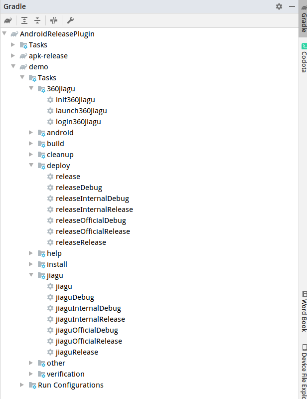

# Android 打包插件


[](https://plugins.gradle.org/plugin/xyz.liut.release)


## 功能说明

- 打包指定变种 apk 输出到指定的文件夹并重命名
- 对指定变种 apk 进行加固（仅支持360加固）

## 使用

### 添加 classpath

``` groovy

buildscript {
    repositories {
        google()
        jcenter()
        // 添加仓库 (临时)
        maven { url "https://dl.bintray.com/lt-123/maven" }
    }
    dependencies {
        classpath 'com.android.tools.build:gradle:4.1.1'
        // 添加 classpath
        classpath 'xyz.liut:apk-release:1.0.40-beta'
    }
}
```

### 应用

``` groovy
// 新方式 (推荐)
plugins {
    // 应用插件
    id "xyz.liut.release"
    id "com.android.application"
}

// ----------------

// 或者 传统方式
apply plugin: 'com.android.application'
// 使用插件
apply plugin: "xyz.liut.release"

```

### tasks 说明

添加并`sync`完成后，会多出三组 task， 如下



#### 360jiagu

- launch360Jiagu    启动360加固 GUI 程序， 使用前需要先配置360加固程序的路径， 请参考下节
- login360Jiagu     登录360加固程序， 首次使用需要在GUI程序中登录， 因为需要接受个协议
- init360Jiagu      登录、导入签名、清空增值服务。 需要配置签名， 请参考下节。

#### deploy

这个组的 task 是和变种相对应的, 可直接对应 task 构建 apk， 结果默认输出在项目路径的 output 文件夹， 输出和文件名称可以自定义， 具体请参考下节配置。

#### jiagu

这个组的 task 也是和变种相对应的， 需要登录360加固， 以及导入签名后才能使用。 登录和导入签名可以自行在GUI程序中配置， 也可以使用 360jiagu 组相关 task 进行配置， 配置操作只需执行一次就行， 之后可以直接进行加固操作。 360加固的登录可能在几个月后自动失效， 这时再登录一次就行。

### 配置

#### Gradle Extension

在项目模块中， 可以添加如下闭包对插件进行配置

> 所有配置都是可选项

```groovy
// 不要添加在 android{} 里面
outputApk {
    /*
    输出文件名称模板, 如下

    $app: module 名称
    $b: buildType 名称
    $f: productFlavor 名称
    $vn: versionName
    $vc: versionCode
     */
    fileNameTemplate = '$app-$b-$f-$vn.$vc'

    // 加固文件输出文件名模板, 规则如上
    jiaguFileNameTemplate = '$app-$b-$f-$vn'

    // 加固参数，可配合360多渠道打包功能使用，如果不知道这是什么， 可以不用管
    jiaguCmdParams = "-autosign -automulpkg"

    // 输出文件夹
    outputPath = './output/'

    // 加固输出文件夹
    jiaguOutputPath = './output/'
    
    // 完后后打开文件夹 此功能支持 MacOS 和 Windows， Linux仅支持nautilus文件管理器
    openDir = true
}
```

#### local.properties 配置

> 如需使用360加固功能， 此项必须配置

Android 项目的跟文件夹一般都有这个文件， 里面有Android SDK 和 NDK 路径配置。 这个文件一般不需要加到版本控制中。 如果没有此文件， 请手动创建一个。

```properties
## This file must *NOT* be checked into Version Control Systems,
# as it contains information specific to your local configuration.
#
# Location of the SDK. This is only used by Gradle.
# For customization when using a Version Control System, please read the
# header note.
#Mon Aug 19 17:43:23 CST 2019
sdk.dir=/Users/liut/Library/Android/sdk
ndk.dir=/Users/liut/Library/Android/sdk/ndk-bundle

##################################################

# 360 加固程序路径 使用加固相关功能必须配置
jiaguPath=/Users/liut/Library/jiagu/jiagu.jar

# 360 用户名 使用插件的登录登录功能必须配置
account360=您的360账户

# 360 密码 使用插件的登录登录功能必须配置
passwd360=您的360密码

# 签名 使用插件的导入签名功能需要提供， 值是app模块中的signingConfigs的名称
apkSigning=appSign

##################################################
```
